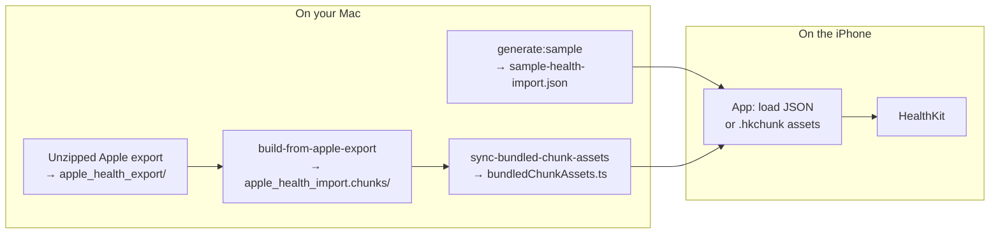

# HealthKit Dummy Seeder

A **development-only** React Native (Expo) tool for loading structured health sample data and writing it to **Apple Health** via HealthKit. Use it to stress-test imports, validate integrations, and reproduce realistic datasets—**not** for App Store distribution.

This README is written for **anyone cloning the repository**: install dependencies, open the iOS project, sign, and run. **Yarn and npm are both supported**—use whichever you prefer; examples below show both.

---

## What this project does

| Capability | Description |
|------------|-------------|
| **Synthetic data** | Generate a full calendar year of high-volume dummy samples (steps, heart rate, water, workouts, etc.) as a single JSON file. |
| **Custom JSON** | Import any compatible JSON file from disk (on-device). |
| **Apple Health export** | Convert an official Apple Health **export** (`export.xml`) into chunked JSON the app can load without blowing up Metro or memory. |
| **HealthKit writes** | Batch-write samples through [`react-native-health`](https://github.com/agencyenterprise/react-native-health) on a **physical iPhone** with a dev build. |

The app is organized around two main flows: **Dummy & file import** and **Apple Health export**, plus a shared **import to Health** pipeline with progress, resume support, and logging.

---

## Why Expo + a development build?

- **Expo Go cannot run this app.** HealthKit requires native code and entitlements that Expo Go does not ship.
- Use **`expo-dev-client`** (or `expo run:ios` after `expo prebuild`). The `react-native-health` config plugin sets HealthKit usage strings and entitlements when you prebuild.
- **Android / web** builds exist for convenience, but **HealthKit writes only run on iOS** with this project’s current implementation.

---

## Requirements

- **macOS** with **Xcode**
- **Physical iPhone** (recommended for realistic HealthKit behavior and permissions)
- **Apple Developer** account for code signing (local device or TestFlight)

---

## Getting started

### 1. Install dependencies

From the repo root:

```bash
yarn install
# or
npm install
```

On **`postinstall`**, `scripts/sync-bundled-chunk-assets.mjs` runs automatically. It regenerates `src/generated/bundledChunkAssets.ts` from `assets/apple_health_import.chunks/manifest.json` (or writes a stub if you have not built Apple export chunks yet).

### 2. iOS native project (usually no `prebuild` needed)

**This repository is maintained with a generated `ios/` directory checked in**, so a normal clone already contains the Xcode workspace and CocoaPods setup. You **do not** need to run `expo prebuild` just to build and run—unless you deleted `ios/`, changed native config in a way that requires regeneration, or are porting to a fresh folder.

> **Maintainers (open source):** For that “clone and run” experience, **`ios/` must be committed**. If your `.gitignore` still ignores `/ios`, remove that rule before publishing so contributors receive the native project.

If you **do** need to recreate native projects (e.g. no `ios/` in your tree):

```bash
npx expo prebuild --platform ios
```

Then install pods (also safe to run after pulling if Xcode complains about pods):

```bash
cd ios && pod install && cd ..
```

Open **`ios/*.xcworkspace`** in Xcode once to select your **development team** and confirm signing. Adjust the bundle identifier in `app.json` / Xcode if it conflicts with another app on your account (`com.healthkitdummyseeder.dev` by default).

### 3. Build and run the dev client

Package scripts wrap Expo’s CLI (`package.json`):

```bash
yarn ios
# or
npm run ios
```

That runs **`expo run:ios`** (simulator by default). For a **physical iPhone** over USB or network:

```bash
yarn ios -- --device
# or
npm run ios -- --device
```

### 4. Start Metro with the development client

In another terminal:

```bash
yarn start -- --dev-client
# or
npm run start -- --dev-client
```

Use **`-- -c`** after `start` if you need a clean Metro cache (e.g. after changing bundled chunk assets): e.g. `yarn start -- --dev-client -c`.

---

## How the app is structured (mental model)



1. **Machine-side scripts** produce files under `assets/` (and generated TypeScript for Metro).
2. **The iOS app** loads either a **bundled JSON module**, **picked `.json`**, or **chunk assets** (`.hkchunk`), then streams writes to HealthKit.

---

## Workflow A — Dummy data (synthetic year)

### 1. Configure and generate

Edit density knobs and the target year in `scripts/generate-year-sample.mjs` (e.g. `YEAR`, `STEP_INTERVALS_PER_DAY`, `HEART_RATE_PER_DAY`, …).

Then run:

```bash
yarn generate:sample
# or
npm run generate:sample
```

This overwrites **`assets/sample-health-import.json`** with one large JSON document: `{ "version": 1, "samples": [ … ] }`.

### 2. Load in the app

Open **Dummy & file import** → **Load bundled sample JSON**. The file is bundled as a JSON module, so it is suitable for **large but bounded** test files that still fit Metro’s JSON pipeline.

### 3. Import to Health

Tap **Import to Health**, grant permissions when iOS prompts, and wait—large runs can take minutes. Use the **resume from global index** field if an import was interrupted (match the last `done` value from Metro logs).

**Why a single JSON for dummy data?** For synthetic tests you control size; one file is simple and fast to iterate. If the generated file ever grows past what Metro can bundle, switch to generating chunks externally or reduce density in the script.

---

## Workflow B — Your own JSON file

On the **Dummy & file import** screen, use **Pick import file (.json)**. The app reads the file with `expo-file-system` and parses the same schema as bundled JSON.

Use this for one-off files or exports you created yourself, without rebuilding the app binary (as long as the JSON matches the schema).

---

## Workflow C — Real Apple Health export (large / multi-GB)

Apple’s export is an **unzipped folder** containing `export.xml` (and often `export_cda.xml`, plus folders such as `electrocardiograms/` and `workout-routes/`). That XML can represent **years of data** and **gigabytes** on disk.

You **do not** paste multi-gigabyte XML through Metro as a single JavaScript string. This project uses a **chunked pipeline** so imports stay **scalable and buildable**.

### Step 1 — Place the export on disk

Unzip Apple’s `export.zip` and copy the contents into:

```text
assets/apple_health_export/
```

At minimum, **`export.xml`** must be present (plus whatever sibling files you rely on). The build script streams `export.xml` with a SAX parser and skips folders this app does not map to HealthKit samples (e.g. **electrocardiograms/**, **workout-routes/**—see `scripts/build-from-apple-export.mjs`).

### Step 2 — Build chunks + sync Metro registry

```bash
yarn import:from-apple-export
# or
npm run import:from-apple-export
```

This runs two steps:

1. **`scripts/build-from-apple-export.mjs`**  
   - Reads `assets/apple_health_export/`.  
   - Emits **`assets/apple_health_import.chunks/`** containing:
     - **`manifest.json`** — chunk list, total sample count, metadata.  
     - **`chunk-00001.hkchunk`**, `chunk-00002.hkchunk`, … — each file is **UTF-8 JSON** with the same shape as your import format (`{ "version": 1, "samples": [ … ] }`), split into pieces of roughly **`DEFAULT_CHUNK_SAMPLES` (10,000)** rows (override with CLI flags).

2. **`scripts/sync-bundled-chunk-assets.mjs`**  
   - Writes **`src/generated/bundledChunkAssets.ts`** with one `require()` per `.hkchunk` as a **Metro asset ID**, not inlined JSON text.

### Step 3 — Run the app with a clean cache when chunks change

After adding or changing chunk files, start Metro with a clean cache so asset maps refresh:

```bash
yarn start -- --dev-client -c
# or
npm run start -- --dev-client -c
```

### Step 4 — Load chunks on device

Open **Apple Health export** → **Load bundled apple_health_import.chunks**. The app loads each `.hkchunk` via `expo-asset` + `readAsStringAsync`, parses JSON, then imports sequentially.

---

## Why `apple_health_import.chunks` and `.hkchunk`?

| Problem | What happens without chunks |
|--------|-----------------------------|
| **Metro bundle limits** | Importing a giant `.json` as a JS module forces Metro to hold the entire string in the bundle graph—**“Invalid string length”** and failed builds are common at GB scale. |
| **Memory** | One massive JSON string in JS heap is hostile to mobile devices. |
| **Iteration** | You want to replace export data without rewriting one monolithic asset. |

| Approach | Benefit |
|----------|---------|
| **`.hkchunk` extension** | Same JSON content as `.json`, but Metro treats files as **binary assets** referenced by numeric asset IDs—**no giant string in the JS bundle**. |
| **`manifest.json`** | Single source of truth for chunk order and **total sample count** (validated at runtime against parsed chunks). |
| **`sync-bundled-chunk-assets.mjs`** | Regenerates `bundledChunkAssets.ts` so the app knows which assets exist—runs on **`yarn install` / `npm install`** via `postinstall`. |

So: **multi-GB exports are handled on your Mac** (streaming XML → chunked JSON files). The **phone** loads chunks **one at a time** from the app bundle, which scales to very large datasets as long as the **app binary size** remains acceptable for your distribution method.

Optional tuning (see script header):

```bash
node scripts/build-from-apple-export.mjs -- --chunk-samples 5000 --out-dir assets/my_chunks
```

(If you change output paths, align `sync-bundled-chunk-assets.mjs` or your asset layout accordingly—the default layout matches the repo conventions.)

---

## Permissions

On first **Import to Health**, iOS shows the Health access sheet (strings come from `app.json` → `react-native-health` plugin). Grant **write** access for the types you import (e.g. steps, heart rate). If you denied access earlier: **Health** app → **Sharing** → **Apps** → this app.

---

## JSON schema (summary)

- Root: `{ "version": 1, "samples": [ … ] }`
- Each element of `samples` is a discriminated object by `type` (`steps`, `heart_rate`, `walking_distance`, `weight`, `water`, `mindful_session`, `workout`, `body_temperature`, `height`, …).

Authoritative definitions live in **`src/types/index.ts`**. Parsing: `src/import/parseImportJson.ts`. HealthKit writers: `src/health/importToHealthKit.ts`.

---

## Package scripts

| Script (`yarn` / `npm run`) | Purpose |
|----------------------------|---------|
| `generate:sample` | Write `assets/sample-health-import.json` (dummy year). |
| `import:from-apple-export` | Build `assets/apple_health_import.chunks/` from `assets/apple_health_export/`, then sync `bundledChunkAssets.ts`. |
| `import:sync-chunk-assets` | Only regenerate `bundledChunkAssets.ts` from existing `manifest.json`. |
| `ios` | Run `expo run:ios` (use `yarn ios -- --device` / `npm run ios -- --device` for a physical iPhone). |
| `start` | Run `expo start` (add `-- --dev-client`; add `-c` for a clean Metro cache). |
| `prebuild` | Run `expo prebuild` if you need to regenerate native projects. |
| `typecheck` | `tsc --noEmit`. |

---

## Project layout (high level)

```text
assets/
  sample-health-import.json       # Generated dummy data (or hand-maintained)
  apple_health_export/            # Unzipped Apple export (export.xml, …)
  apple_health_import.chunks/     # Built chunks + manifest.json
scripts/
  generate-year-sample.mjs
  build-from-apple-export.mjs
  sync-bundled-chunk-assets.mjs
src/
  types/index.ts                  # Shared types and IMPORT_VERSION
  features/health-import/         # Import session context + HealthKit orchestration
  health/                         # HealthKit init and batched writes
  import/                         # JSON parsing, Apple XML parsing, bundled chunk loading
  screens/                        # Home, Dummy & file, Apple export flows
  generated/bundledChunkAssets.ts   # Auto-generated asset registry (do not edit)
App.tsx                           # Providers + navigation
metro.config.js                   # Registers .hkchunk as asset; blocks mistaken huge .json chunks
```

---

## Extending the importer

- Add a new `type` in **`src/types/index.ts`** and validation in **`src/import/parseImportJson.ts`**.
- Add the matching save path in **`src/health/importToHealthKit.ts`** and extend **`initHealthKit`** permissions as needed.

---

## License / disclaimer

This project is intended as a **developer utility**, not a consumer health product. Apple Health exports can contain sensitive data—handle them according to your own security and privacy requirements.
